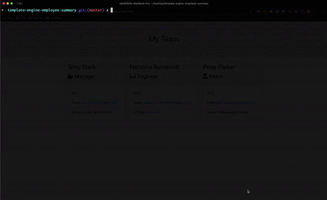

[](https://travis-ci.com/sdanyalk/template-engine-employee-summary)
[](https://coveralls.io/github/sdanyalk/template-engine-employee-summary?branch=master)
[](license)


This is the solution for homework assignment-10 of University of Arizona Coding Bootcamp. As an instructor, I have provided my solution as guidance to my students. I have licensed this code under [MIT license](license), which means that if you use any code from here, you will need to reference the copyright **exactly** as it is. Even after doing that, if you try to submit your homework using any code from here, it will be considered **plagarism**.

---

# Template Engine Employee Summary
Software engineering team generator command line application. This is a `nodejs` application, that uses `inquirer` to gather employee information in order to form an engineering team.

---

## Demo



---

## Installation

1. Clone this repository.
    ```
    git clone https://github.com/sdanyalk/template-engine-employee-summary.git
    ```
1. Navigate into the cloned directory.
    ```
    cd template-engine-employee-summary
    ```
1. Install Nodejs dependencies.
    ```
    npm install
    ```
1. In the root directory of the project, start the app.
    ```
    node app.js
    ```
1. Run tests
    ```
    npm run test
    ```

---

